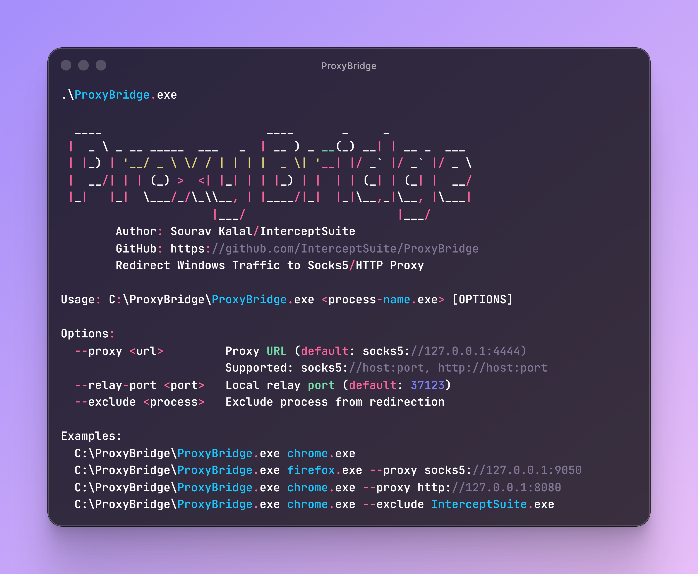

# ProxyBridge



## Overview

ProxyBridge is a transparent proxy traffic redirector for Windows that intercepts and redirects TCP traffic from specific applications through SOCKS5 or HTTP proxies. It works at the kernel level using WinDivert, making it compatible with proxy-unaware applications without requiring any configuration changes.


## Features

- Process-based traffic redirection (target specific applications)
- Works with proxy-unaware applications
- Supports SOCKS5 and HTTP proxies
- Kernel-level packet interception using WinDivert
- No application configuration required
- Compatible with any TCP protocol (HTTP, HTTPS, databases, RDP, SSH, etc.)
- Process exclusion to prevent proxy loops

## Installation

1. Download the latest `ProxyBridge-vX.X.zip` from the [Releases](https://github.com/InterceptSuite/ProxyBridge/releases) page
2. Extract the ZIP file to your preferred location
3. Run `ProxyBridge.exe` with Administrator privileges (required for WinDivert driver)

**Note:** The release ZIP includes all required files (ProxyBridge.exe, WinDivert.dll, WinDivert64.sys). No additional downloads needed.

**Important:** Administrator privileges are required to load the WinDivert kernel driver.

## Usage

### Basic Usage
```powershell
# Redirect Chrome through default SOCKS5 proxy (127.0.0.1:4444)
.\ProxyBridge.exe chrome.exe

# Redirect Chrome through InterceptSuite
.\ProxyBridge.exe chrome.exe --exclude InterceptSuite.exe

# Redirect Discord through InterceptSuite SOCKS5 proxy
.\ProxyBridge.exe discord.exe --proxy socks5://127.0.0.1:4444

# Redirect Chrome through Burp Suite HTTP proxy
.\ProxyBridge.exe chrome.exe --proxy http://127.0.0.1:8080

# Exclude Burp Suite from redirection (prevent proxy loops)
.\ProxyBridge.exe chrome.exe --proxy http://127.0.0.1:8080 --exclude BurpSuiteCommunity.exe

.\ProxyBridge.exe chrome.exe --proxy http://127.0.0.1:8080 --exclude BurpSuitePro.exe

# Use custom relay port
.\ProxyBridge.exe chrome.exe --relay-port 40000
```

### Command Line Options
```
--proxy <url>         Proxy URL (default: socks5://127.0.0.1:4444)
                      Supported: socks5://host:port, http://host:port
--relay-port <port>   Local relay port (default: 37123)
--exclude <process>   Exclude process from redirection
```

## Use Cases

- Redirect proxy-unaware applications (games, desktop apps) through InterceptSuite/Burp Suite for security testing
- Route specific applications through Tor,SOCKS5 or HTTP proxies
- Intercept and analyze traffic from applications that don't support proxy configuration
- Test application behavior under different network conditions
- Analyze protocols and communication patterns


## Current Limitations

- IPv4 only (IPv6 not supported)
- TCP only (UDP not supported)
- Single process targeting at a time


## How It Works

```
                                    Your Application
                                 (Chrome, Discord, etc.)
                                    Proxy-Unaware
                                          |
                                          | (1) Raw TCP Packets
                                          v
[user mode]                               |
...........................................+...........................................
[kernel mode]                             |
                                          v
                              +------------------------+
                              |   WinDivert.sys        |
         (1) All packets ---->|   (Kernel Driver)      |
         intercepted          |   - Intercepts ALL TCP |
                              +------------------------+
                                          |
                                          | (2) Sends ALL packets to ProxyBridge
                                          v
...........................................+...........................................
[kernel mode]                             |
[user mode]                               v
                              +------------------------+
                              | ProxyBridge.exe        |
                              | Packet Handler         |
                              | - Checks process name  |
                              | - Matches target?      |
                              +------------------------+
                                    |            |
                     (matching)     |            | (non-matching)
                     redirect       |            | re-inject unchanged
                                    |            |
                                    |            +-------------------> Internet
                                    |                                (direct connection)
                                    | (3) re-inject with modified
                                    |     destination: localhost:37123
                                    v
                              +------------------------+
                              | ProxyBridge            |
                              | TCP Relay Server       |
                              | (localhost:37123)      |
                              | - Tracks origin        |
                              | - Converts TCP to      |
                              |   SOCKS5/HTTP protocol |
                              +------------------------+
                                    |
                                    | SOCKS5/HTTP CONNECT
                                    v
                              +------------------------+
                              | Proxy Server           |
                              | (Burp/InterceptSuite)  |
                              | 127.0.0.1:8080/4444    |
                              +------------------------+
                                    |
                                    | Proxied Traffic
                                    v
                                 Internet
```

**Key Points:**
- WinDivert.sys sits between application and network, intercepts ALL TCP packets
- ALL packets are sent to ProxyBridge in user space for inspection
- ProxyBridge checks process name and decides: redirect or forward unchanged
- Matching packets are re-injected with destination changed to localhost:37123
- Non-matching packets are re-injected unchanged and go directly to Internet
- TCP Relay Server converts raw TCP to SOCKS5/HTTP proxy protocol
- This allows proxy-unaware apps to work with proxy servers


## Build from Source


### Requirements

- Windows 7 or later (64-bit)
- Administrator privileges (required for WinDivert driver)
- WinDivert 2.2.2-A or later
- GCC (MinGW-w64) or MSVC compiler

If you prefer to build ProxyBridge from source:

1. Download WinDivert 2.2.2-A from the [official website](https://reqrypt.org/windivert.html)
2. Extract WinDivert to a known location (e.g., `C:\WinDivert-2.2.2-A`)
3. Clone or download ProxyBridge source code
4. Compile using one of the methods below:

### Using PowerShell Script
```powershell
.\compile.ps1
```

### Using GCC Directly
```powershell
gcc -O2 -Wall -D_WIN32_WINNT=0x0601 -I"C:\WinDivert-2.2.2-A\include" ProxyBridge.c -L"C:\WinDivert-2.2.2-A\x64" -lWinDivert -lws2_32 -liphlpapi -o ProxyBridge.exe
```

5. Run `ProxyBridge.exe` with Administrator privileges

## License

MIT License - See LICENSE file for details

## Author

Sourav Kalal / InterceptSuite

## Project

https://github.com/InterceptSuite/ProxyBridge

## Credits

This project is built on top of [WinDivert](https://reqrypt.org/windivert.html) by basil00. WinDivert is a powerful Windows packet capture and manipulation library that makes kernel-level packet interception possible. Special thanks to the WinDivert project for providing such a robust foundation.

Based on the StreamDump example from WinDivert:
https://reqrypt.org/samples/streamdump.html