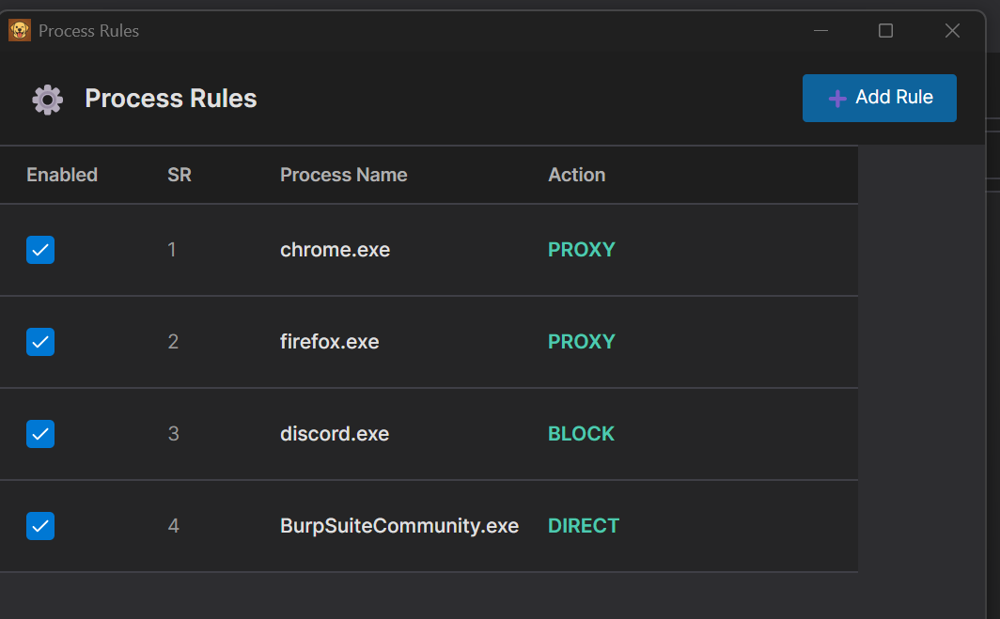

# ProxyBridge

<p align="center">
  
</p>


ProxyBridge is a lightweight, open-source alternative to Proxifier that provides transparent proxy routing for Windows applications. It redirects TCP and UDP traffic from specific processes through SOCKS5 or HTTP proxies, with the ability to route, block, or allow traffic on a per-application basis. Working at the kernel level using WinDivert, ProxyBridge is compatible with proxy-unaware applications without requiring any configuration changes.

## Features

- **Dual interface** - Feature-rich GUI and powerful CLI for all use cases
- **Process-based traffic control** - Route, block, or allow traffic for specific applications
- **Universal compatibility** - Works with proxy-unaware applications
- **Multiple proxy protocols** - Supports SOCKS5 and HTTP proxies
- **Kernel-level interception** - Uses WinDivert for reliable packet capture
- **No configuration needed** - Applications work without any modifications
- **Protocol agnostic** - Compatible with TCP and UDP protocols (HTTP/HTTPS, HTTP/3, databases, RDP, SSH, games, DTLS, DNS, etc.)
- **Traffic blocking** - Block specific applications from accessing the internet or any network (LAN, localhost, etc.)
- **Flexible rules** - Direct connection, proxy routing, or complete blocking per process
- **Advanced rule configuration** - Target specific processes, IPs, ports, protocols (TCP/UDP), and hostnames with wildcard support
- **Process exclusion** - Prevent proxy loops by excluding proxy applications

## Table of Contents

- [Installation](#installation)
- [Usage](#usage)
  - [GUI Application](#gui-application)
    - [Proxy Settings](#proxy-settings)
    - [Process Rules](#process-rules)
    - [Activity Monitoring](#activity-monitoring)
  - [Command Line Interface (CLI)](#command-line-interface-cli)
    - [Basic Usage](#basic-usage)
    - [Command Line Options](#command-line-options)
    - [Rule Examples](#rule-examples)
- [Use Cases](#use-cases)
- [Current Limitations](#current-limitations)
- [How It Works](#how-it-works)
- [Build from Source](#build-from-source)
- [License](#license)
- [Author](#author)
- [Credits](#credits)

## Installation

1. Download the latest `ProxyBridge-Installer-vX.X.X.exe` from the [Releases](https://github.com/InterceptSuite/ProxyBridge/releases) page
2. Run the installer with Administrator privileges
3. The installer will:
   - Install ProxyBridge to `C:\Program Files\ProxyBridge`
   - Add the CLI to your system PATH for easy command-line access
   - Create Start Menu shortcuts for the GUI application
   - Include all required dependencies (WinDivert driver)


## Usage

### GUI Application

Launch `ProxyBridge.exe` (GUI) with Administrator privileges for an intuitive graphical interface to:

#### Proxy Settings

<p align="center">
  
</p>

1. Click **Proxy** tab in the main window
2. Click **Proxy Settings** from the menu
3. Select **Proxy Type** (SOCKS5 or HTTP)
4. Enter **Proxy IP Address** (e.g., 127.0.0.1)
5. Enter **Proxy Port** (e.g., 1080 for SOCKS5, 8080 for HTTP)
6. (Optional) Enter **Proxy Username** and **Proxy Password** for authenticated proxies
7. Click **Save Changes**

**Test Proxy Connection:**
1. Click **Test Proxy Connection** button
2. Enter **Destination IP/Host** (default: google.com)
3. Enter **Destination Port** (default: 80)
4. Click **Start Test** to verify proxy connectivity
5. View test results in the output area

#### Process Rules

<p align="center">
  
</p>

<p align="center">
  
</p>

1. Click **Proxy** tab in the main window
2. Click **Proxy Rules** from the menu
3. Configure rule parameters:

   **Applications:**
   - Use `*` as wildcard for all processes
   - Enter single process: `chrome.exe`
   - Enter multiple processes (semicolon-separated): `firefox.exe; chrome.exe`
   - Use **Browse** button to select process executable from directory

   **Target Hosts (Optional):**
   - Specific IP: `127.0.0.1`
   - Wildcard IP range: `127.0.*.*` or `192.168.*.*`
   - Multiple IPs: `127.0.0.1; 192.168.1.1`
   - IP range: `10.10.1.1-10.10.255.255`
   - Leave empty or use `*` for all hosts

   **Target Ports (Optional):**
   - Specific ports: `80; 8080`
   - Port range: `80-8000`
   - Leave empty or use `*` for all ports

   **Protocol:**
   - Select **TCP**, **UDP**, or **Both (TCP + UDP)**

   **Action:**
   - **PROXY** - Route through configured proxy
   - **DIRECT** - Allow direct internet access
   - **BLOCK** - Block all internet access

4. Click **Save Rule** to apply the configuration

#### Activity Monitoring

<p align="center">
  
</p>

- View real-time connection activity in the **Connections** tab
- Monitor all system connections including both TCP and UDP protocols
- See connections from all processes, whether they match rules or not
- Track which processes are active and their routing status (PROXY, DIRECT, or BLOCK)
- Search and filter connections using the search box


**Note:** Adding a rule with action **PROXY** while no proxy is configured will result in traffic being routed through a direct connection instead. Make sure to configure proxy settings before using PROXY rules.

### Command Line Interface (CLI)

The CLI provides powerful automation and scripting capabilities with rule-based traffic control:

#### Basic Usage
```powershell
# Help menu
ProxyBridge_CLI -h

# Use custom HTTP proxy
ProxyBridge_CLI --proxy http://192.168.1.100:8080

# Route Chrome through socks5 proxy
ProxyBridge_CLI --proxy socks5://127.0.0.1:1080 --rule "chrome.exe=proxy"

# Block specific application from internet access
ProxyBridge_CLI --rule "chrome.exe=block"

# Route specific apps through proxy, block everything else
ProxyBridge_CLI --rule "chrome.exe=proxy;firefox.exe=proxy;*=block"

# Route all through proxy except proxy app itself
ProxyBridge_CLI --rule "*=proxy;BurpSuiteCommunity.exe=direct"

```

#### Command Line Options
```
ProxyBridge_CLI.exe -h

  ____                        ____       _     _
 |  _ \ _ __ _____  ___   _  | __ ) _ __(_) __| | __ _  ___
 | |_) | '__/ _ \ \/ / | | | |  _ \| '__| |/ _` |/ _` |/ _ \
 |  __/| | | (_) >  <| |_| | | |_) | |  | | (_| | (_| |  __/
 |_|   |_|  \___/_/\_\\__, | |____/|_|  |_|\__,_|\__, |\___|
                      |___/                      |___/  V2.0

  Universal proxy client for Windows applications

        Author: Sourav Kalal/InterceptSuite
        GitHub: https://github.com/InterceptSuite/ProxyBridge

Description:
  ProxyBridge - Universal proxy client for Windows applications

Usage:
  ProxyBridge_CLI [command] [options]

Options:
  --proxy <proxy>      Proxy server URL with optional authentication
                       Format: type://ip:port or type://ip:port:username:password
                       Examples: socks5://127.0.0.1:1080
                                 http://proxy.com:8080:myuser:mypass [default: socks5://127.0.0.1:4444]
  --rule <rule>        Traffic routing rule (multiple values supported, can repeat)
                       Format: process:hosts:ports:protocol:action
                         process  - Process name(s): chrome.exe, chr*.exe, *.exe, or *
                         hosts    - IP/host(s): *, google.com, 192.168.*.*, or multiple comma-separated
                         ports    - Port(s): *, 443, 80,443, 80-100, or multiple comma-separated
                         protocol - TCP, UDP, or BOTH
                         action   - PROXY, DIRECT, or BLOCK
                       Examples:
                         chrome.exe:*:*:TCP:PROXY
                         *:*:53:UDP:PROXY
                         firefox.exe:*:80,443:TCP:DIRECT
  --dns-via-proxy      Route DNS queries through proxy (default: true) [default: True]
  --verbose <verbose>  Logging verbosity level
                         0 - No logs (default)
                         1 - Show log messages only
                         2 - Show connection events only
                         3 - Show both logs and connections [default: 0]
  --version            Show version information
  -?, -h, --help       Show help and usage information

Commands:
  --update  Check for updates and download latest version from GitHub

```

#### Rule Examples
```powershell
# Single process rule
--rule "chrome.exe=proxy"

# Multiple processes with different actions
--rule "chrome.exe=proxy;firefox.exe=direct;malware.exe=block"

# Default action for all unmatched processes
--rule "chrome.exe=proxy;*=direct"

# Whitelist approach (block everything except specific apps)
--rule "chrome.exe=proxy;firefox.exe=proxy;*=block"
```

**Notes:**
- After installation, the CLI is available from any terminal (no `.\` prefix needed)
- Process names are case-insensitive
- Use `*` as the process name to set a default action for all traffic
- Press `Ctrl+C` to stop ProxyBridge

## Use Cases

- Redirect proxy-unaware applications (games, desktop apps) through InterceptSuite/Burp Suite for security testing
- Route specific applications through Tor,SOCKS5 or HTTP proxies
- Intercept and analyze traffic from applications that don't support proxy configuration
- Test application behavior under different network conditions
- Analyze protocols and communication patterns


## Current Limitations

- IPv4 only (IPv6 not supported)


## How It Works

ProxyBridge use Windivert to inspect all TCP/UDP packets and use rules from user to perform action on them

Case 1: Packet does not match any rules

<p align="center">
  
</p>


Case 2: Packet match with proxy rule


<p align="center">
  
</p>

**Traffic Flow:**
1. **Applications Generate Traffic** - User-mode applications (Chrome, Discord, Games, Services) create TCP/UDP packets
2. **Kernel Interception** - WinDivert.sys driver intercepts ALL outbound packets at kernel level
3. **User-Mode Delivery** - WinDivert.dll receives intercepted packets and delivers them to ProxyBridge
4. **Rule Evaluation** - ProxyBridge inspects each packet and applies configured rules:
   - **BLOCK** → Packet is dropped (no network access)
   - **DIRECT** → Packet is re-injected unchanged (direct connection)
   - **NO MATCH** → Packet is re-injected unchanged (direct connection)
   - **PROXY** → Packet destination is modified to TCP/UDP relay servers (34010/34011)
5. **Proxy Processing** - For PROXY-matched packets:
   - Relay servers store original destination IP and port
   - Convert raw TCP/UDP to SOCKS5/HTTP proxy protocol
   - Perform proxy authentication and forward to proxy server
6. **Proxy Forwarding** - Proxy server (Burp Suite/InterceptSuite) forwards traffic to original destination
7. **Response Handling** - Return traffic flows back through relay servers, which restore original source IP/port before re-injection

**Key Points:**
- All packet manipulation happens transparently - applications remain completely unaware
- WinDivert operates at kernel level for reliable interception before packets reach the network
- ProxyBridge rule engine provides granular control over which traffic gets proxied
- TCP/UDP relay servers handle protocol conversion between raw sockets and proxy protocols


## Build from Source


### Requirements

- Windows 7 or later (64-bit)
- Administrator privileges (required for WinDivert driver)
- WinDivert 2.2.2-A or later
- GCC (MinGW-w64) or MSVC compiler

If you prefer to build ProxyBridge from source:

1. Download WinDivert 2.2.2-A from the [official website](https://reqrypt.org/windivert.html)
2. Extract WinDivert to a known location (e.g., `C:\WinDivert-2.2.2-A`)
3. Clone or download ProxyBridge source code
4. Compile using one of the methods below:

### Using PowerShell Script
```powershell
.\compile.ps1
```

### Using GCC Directly
```powershell
gcc -O2 -Wall -D_WIN32_WINNT=0x0601 -I"C:\WinDivert-2.2.2-A\include" ProxyBridge.c -L"C:\WinDivert-2.2.2-A\x64" -lWinDivert -lws2_32 -liphlpapi -o ProxyBridge.exe
```

5. Run `ProxyBridge.exe` with Administrator privileges

## License

MIT License - See LICENSE file for details

## Author

Sourav Kalal / InterceptSuite

## Credits

This project is built on top of [WinDivert](https://reqrypt.org/windivert.html) by basil00. WinDivert is a powerful Windows packet capture and manipulation library that makes kernel-level packet interception possible. Special thanks to the WinDivert project for providing such a robust foundation.

Based on the StreamDump example from WinDivert:
https://reqrypt.org/samples/streamdump.html